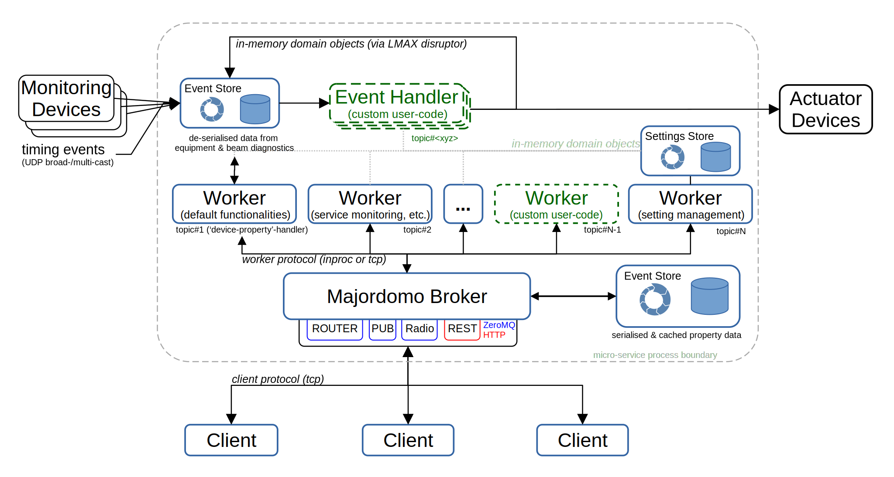

<picture>
<source srcset="assets/OpenCMW_logo_w.svg" media="(prefers-color-scheme: dark)">
<!--suppress HtmlDeprecatedAttribute -->

</picture>

[](https://gitter.im/fair-acc/opencmw?utm_source=badge&utm_medium=badge&utm_campaign=pr-badge)
[](https://opensource.org/licenses/LGPL-3.0)
[](https://search.maven.org/search?q=g:io.opencmw)

[](https://lgtm.com/projects/g/fair-acc/opencmw-java/context:java)
[](https://app.codacy.com/gh/fair-acc/opencmw-java)
[](https://www.codacy.com/gh/fair-acc/opencmw-java/dashboard?utm_source=github.com&utm_medium=referral&utm_content=fair-acc/opencmw-java&utm_campaign=Badge_Coverage)
# Open Common Middle-Ware
... is a modular event-driven [micro-](https://en.wikipedia.org/wiki/Microservices) and [middle-ware](https://en.wikipedia.org/wiki/Middleware#:~:text=Middleware%20is%20a%20computer%20software,described%20as%20%22software%20glue%22.)
library for equipment- and beam-based monitoring as well as feedback control systems for the [FAIR](https://fair-center.eu/) Accelerator Facility ([video](https://www.youtube.com/watch?v=gCHzDR7hdoM)) 
or any other project that may find this useful.

In a nut-shell: it provides common communication protocols, interfaces to numerical data [visualisation](https://github.com/GSI-CS-CO/chart-fx) 
and processing tools that shall aid accelerator engineers and physicist to write functional high-level monitoring and 
(semi-)automated feedback applications that interact, simplify and improve our accelerator operation or its individual sub-systems.
Most notably, the focus is put on minimising the amount of boiler-plate code, programming expertise, and to significantly 
lower the entry-threshold that is required to perform simple to advanced monitoring or 'measure-and-correct' applications 
where the frame-work takes care of most of the communication, [data-serialisation](docs/IoSerialiser.md) data-aggregation 
and buffering, settings management, Role-Based-Access-Control (RBAC), and other boring but necessary control system integrations 
while still being open to expert-level modifications, extensions or improvements.  

### General Schematic
A schematic outline of the internal [architecture](https://edms.cern.ch/document/2444348/1) ([local copy](assets/F-CS-SIS-en-B_0006_FAIR_Service_Middle_Ware_V1_0.pdf)) is shown below:

 

### Example
The following provides some flavour of how a simple service can be implemented using OpenCMW with only a few lines of 
custom user-code ([full sample](https://github.com/fair-acc/opencmw-java/tree/createReadme/server-rest/src/test/java/io/opencmw/server/rest/samples/BasicSample.java)):

```Java
@MetaInfo(description = "My first 'Hello World!' Service")
public static class HelloWorldWorker extends MajordomoWorker<BasicRequestCtx, NoData, ReplyData> {
    public HelloWorldWorker(final ZContext ctx, final String serviceName, final RbacRole<?>... rbacRoles) {
        super(ctx, serviceName, BasicRequestCtx.class, NoData.class, ReplyData.class, rbacRoles);

        // the custom used code:
        this.setHandler((rawCtx, requestContext, requestData, replyContext, replyData) -> {
            final String name = Objects.requireNonNullElse(requestContext.name, "");
            replyData.returnValue = name.isBlank() ? "Hello World" : "Hello, " + name + "!";
            replyContext.name = name.isBlank() ? "At" : (name + ", at") + " your service!";
        });
    }
}

@MetaInfo(description = "arbitrary request domain contex object", direction = "IN")
public static class BasicRequestCtx {
    @MetaInfo(description = " optional 'name' OpenAPI documentation")
    public String name;
}

@MetaInfo(description = "arbitrary reply domain object", direction = "OUT")
public static class ReplyData {
    @MetaInfo(description = " optional 'returnValue' OpenAPI documentation", unit="a string")
    public String returnValue;
}
```

These services can accessed using OpenCMW's own [DataSourcePublisher](./client/src/test/java/io/opencmw/client/DataSourceExample.java)
client ([ZeroMQ](https://zeromq.org/-based) that queries or subscribes using either one of the highly-optimised binary
or a RESTful (e.g. JSON-based) wire-formats, or through a simple RESTful web-interface that also provides simple 
'get', 'set' and 'subscribe' functionalities while developing, for testing, or debugging:


The basic HTML rendering is based on Apache's [velocity](https://velocity.apache.org/) template engine which can be customised. 
Alternatively, there are also an increasing number of further service implementations like, for example, the [ClipboardWorker](/server/src/main/java/io/opencmw/server/ClipboardWorker.java) 
that in combination with other UI technologies (e.g. [chartfx](https://github.com/GSI-CS-CO/chart-fx)) allow to efficiently 
create more complex monitoring or fixed-displays with only a few hundred of lines. It is also planned to also embed 
WebAssembly-based ([WASM](https://en.wikipedia.org/wiki/WebAssembly)) applications for more efficient, complex and 
cross-platform UI designs.   

### Performance
The end-to-end transmission achieving roughly 10k messages per second for synchronous communications and 
about 140k messages per second for a-synchronuous and or publish-subscribe style data acquisition (local TCP link via locahost) 
with the domain-object abtraction and serialiser taking typically only 5% of the overall performance w.r.t. bare-metal 
transmissions (ie. raw byte buffer transmission performance via ZeroMQ):
```
CPU:AMD Ryzen 9 5900X 12-Core Processor
description; n_exec; n_workers #0; #1; #2; #3; #4; avg
get,  sync, future,     domain-object ; 10000; 1;   7124.48;  10166.67;  10651.01;  10846.83;  10968.31;  10658.21
get,  sync, eventStore, domain-object ; 10000; 1;   9842.93;   9789.00;   9777.39;   9270.77;   9805.15;   9660.58
get,  sync, eventStore, raw-byte[]    ; 10000; 1;  12237.14;  12256.34;  12259.75;  13151.36;  13171.80;  12709.81
get, async, eventStore, domain-object ; 10000; 1;  46134.05;  50850.82;  48108.52;  54487.72;  46171.67;  49904.68
get, async, eventStore, raw-byte[]    ; 10000; 1;  48972.78;  53278.84;  52600.98;  54832.65;  53027.51;  53435.00
sub, async, eventStore, domain-object ; 10000; 1;  70222.57; 115074.45; 161601.24; 132852.50; 164151.85; 143420.01
sub, async, eventStore, raw-byte[]    ; 10000; 1; 121308.73; 123829.95; 124283.37; 166348.23; 128094.40; 135638.99
sub, async, callback,   domain-object ; 10000; 1; 111274.04; 118184.64; 123098.70; 116418.52; 107858.25; 116390.03
```
Your mileage may vary depending on the specific domain-object, processing logic, and choice of hardware (CPU/RAM),
but you can check and compare the results for your platform using the [RoundTripAndNotifyEvaluation](./concepts/src/test/java/io/opencmw/concepts/RoundTripAndNotifyEvaluation.java)
and/or [MdpImplementationBenchmark](./client/src/test/java/io/opencmw/client/benchmark/MdpImplementationBenchmark.java) benchmarks.
While -- of course -- always subject to improvements, this initial not yet optimised performance is acceptable for our
initial purposes of interfacing with Java-based (often RMI-only) systems. 

### Documentation
.... more to follow.

### Don't like Java?
For faster applications and interaction hardware-based systems (e.g. DAQ controller/digitizer, etc.), a C++-based 
[OpenCMW](https://github.com/fair-acc/opencmw-cpp) twin-project is being developed which follows the same functional style 
but takes advantage of more concise implementation and C++-based type safety. 
Stay tuned...

### Acknowledgements
The implementation heavily relies upon and re-uses time-tried and well established concepts from [ZeroMQ](https://zeromq.org/) 
(notably the [Majordomo](https://rfc.zeromq.org/spec/7/) communication pattern, see [Z-Guide](https://zguide.zeromq.org/docs/chapter4/#Service-Oriented-Reliable-Queuing-Majordomo-Pattern) 
for details), LMAX's lock-free ring-buffer [disruptor](https://lmax-exchange.github.io/disruptor/), [GNU-Radio](https://www.gnuradio.org/) 
real-time signal processing framework, [Javalin] for the RESTful interface, as well as previous implementations and 
experiences gained at [GSI](https://www.gsi.de/), [FAIR](https://fair-center.eu/) and [CERN](https://home.cern/).


